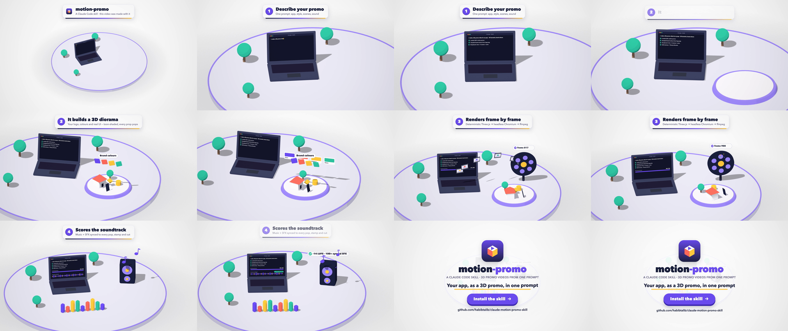

<div align="center">


# motion-promo

**A Claude Code skill that turns one prompt into a polished 3D isometric promo video, with a soundtrack.**

[](LICENSE)
[](https://docs.anthropic.com/en/docs/claude-code)
[](https://threejs.org)
[](https://ffmpeg.org)

<a href="media/demo.mp4"></a>

<sub>▶ <a href="media/demo.mp4"><b>Watch the MP4 with sound</b></a> · This whole video was made <i>by this skill, about this skill</i>. Source: <a href="motion-promo/examples/skill-promo/scene.js"><code>examples/skill-promo</code></a></sub>

</div>

---

## Why

When you ask an AI to "make a promo video" you usually get flat slides and linear fades. **motion-promo** gives Claude an art direction and a production pipeline instead:

- 🎲 **3D isometric diorama** in a Storyset-style flat look: toon shading, soft shadows, a grey ground disc, brand colours only
- 🎥 **An orthographic camera that keeps moving**, slowly orbiting and zooming between scenes
- 🫧 **Every prop pops in with a spring bounce**, staggered, with faster exits
- 💻 **Your real UI** on a laptop or phone screen (screenshots, or UI drawn live that types itself)
- 🏷️ **Caption cards** with word-by-word reveals, and an **outro** with logo, tagline and a CTA that a cursor clicks
- 🔊 **A synthesized soundtrack**: an uplifting music bed plus SFX (pops, typing, stamps, chimes, coins, whooshes) synced to each event, normalised to -14 LUFS
- 🎯 **Frame-accurate and deterministic.** Each frame is a pure function of `t`, so there are no dropped frames and no timeouts, at any length

## Install

```bash
git clone https://github.com/habibtalib/claude-motion-promo-skill.git
mkdir -p ~/.claude/skills
cp -r claude-motion-promo-skill/motion-promo ~/.claude/skills/
```

For a single project only, copy it into `<repo>/.claude/skills/` instead.

**Requirements:** Node 18+, `ffmpeg`, Python 3 with `numpy` (and `Pillow` for colour sampling), and Playwright Chromium (`npx playwright install chromium`). The macOS system font "Avenir Next" is used by default. On Linux, drop a `.woff2` into `assets/` (see `SKILL.md`).

## Use

Open Claude Code in your app's repo and ask:

> *"Make a 30 second promo video for this app"*
> *"Buat video promo untuk app ni"*
> *"Write me a detailed prompt for a 3D promo video of my app"* (prompt only, for claude.ai)

Claude then:

1. **Gathers brand inputs.** It finds your logo, samples colours from it (no guessed hex codes), screenshots public pages, and uses fictional data only.
2. **Writes a storyboard:** one feature per scene, each with a physical metaphor (a form that types itself, papers flying into a folder, a stamp slamming, coins flying along a dotted line…).
3. **Builds `scene.js`** with the helper library, then previews key frames and fixes framing issues before rendering.
4. **Renders, scores and mixes** with `./make.sh`, then verifies the result with a contact sheet, frames pulled from the final MP4, and loudness and peak levels.

> [!TIP]
> Long or complex videos often time out in the claude.ai web sandbox. This pipeline runs on your machine, so a render can take as long as it needs. The 29s demo above renders in about 60s on Apple Silicon.

## How it works

```mermaid
flowchart LR
  A[scene.js<br/>Three.js diorama<br/>renderAt&#40;t&#41;] -->|headless Chromium<br/>1 screenshot per frame| B[render.mjs]
  B -->|PNG pipe| C[ffmpeg<br/>h264 + vignette]
  A -->|events.json<br/>every pop, stamp, cut| D[audio.py<br/>numpy synth]
  C --> E[make.sh<br/>mux + loudnorm -14 LUFS<br/>contact sheet + checks]
  D --> E
  E --> F[(promo.mp4)]
```



Because each frame is a pure function of time, the scene records **sound events** as it is built: `pop()` emits a pop, `cameraRig` emits a whoosh at each cut, and `captions` emits a swish. `audio.py` then places every SFX on exactly the right sample. The music grid shares the scene's `BPM`, so camera cuts can land on the beat.

<div align="center"></div>

## Quick start without Claude

```bash
cp -R motion-promo/template ~/my-promo && cd ~/my-promo && npm i
node render.mjs preview 1,4,7,10     # → preview/f_*.png, fast visual check
./make.sh 30 "" my-promo             # fps, bpm ("" = from scene.js), name → out/my-promo.mp4
```

Edit `scene.js` (props, timeline, camera), the brand tokens in `index.html :root`, and the outro copy in `index.html #outro`. The template is a 12s working demo. [`examples/skill-promo`](motion-promo/examples/skill-promo) is a complete 29s video built on the same library.

<details>
<summary><b>lib.js cheat sheet</b></summary>

| Helper | What it does |
|---|---|
| `P(u, v, y)` · `FACE` | Diorama coordinates: `u` = screen-right, `v` = toward the camera. `rotation.y = FACE` turns an object to face the camera |
| `pop(obj, t0, { out, pitch })` | Spring bounce-in (optional faster exit) that also emits a `pop` sound |
| `groundDisc` `laptop` `phone` `tree` `card` | Ready-made toon props |
| `liveCanvas(w, h, draw)` | A canvas redrawn every frame, e.g. a screen that types itself |
| `pillTex` · `sprite` · `canvasTex` | Labels and text on 3D objects |
| `burst(scene, t0, pos)` | Confetti |
| `bezier(a, q, b)` | Curved path for flying objects |
| `cameraRig(camera, shots)` | Drifting ortho shots with eased blends, a whoosh at each cut, camera shake |
| `captions([...])` · `outro([...])` | Caption cards and the end card, with word-by-word reveals and a cursor click |
| `beatGrid(bpm)` · `countUp(...)` | Put cuts on the beat; count numbers up |
| `ev(t, type)` | Emit a sound: `pop swish whoosh card type ding click scan stamp chime sparkle coin chaching celebrate shimmer` |

</details>

<details>
<summary><b>The prompt recipe</b> (useful on claude.ai too)</summary>

A generic prompt gives a generic video. Name the style, the camera, each prop and a physical metaphor for each feature:

```text
Make a 30 second promo video for my app <NAME> as a 3D isometric diorama in flat
illustration style (like Storyset): toon shading, soft shadows, white background,
a grey ground disc, brand colours <#hex, #hex> only. Use an orthographic camera that
slowly orbits and zooms between scenes, never fully still. Every object pops in
with a bounce. Props on the disc: a laptop showing the real app UI, <props…>.

Show one feature per scene, each with a caption card at the top:
1. <Feature>: <physical metaphor: the form types itself, totals count up…>
2. …
End with the logo, tagline and a "Try now" button.
Audio: uplifting music bed; a pop on every object, typing clicks, a stamp thud, a
chime on success, and a whoosh on every camera move.
```

</details>

## What's inside

```
motion-promo/
├── SKILL.md                 # workflow, design rules, pre-delivery checklist, gotchas
├── template/                # copy to start: lib.js, scene.js, index.html, render.mjs, audio.py, make.sh
└── examples/skill-promo/    # the demo video above
media/                       # demo.mp4, demo.gif, contact sheet, logo
```

## Credits

- Motion-craft rules (stagger, 3-property entrances, fast exits, holds, early SFX, verify every render) are adapted from [haidrrrry/claude-remotion-skill](https://github.com/haidrrrry/claude-remotion-skill). It pairs well with this skill for 2D kinetic typography and for adding captions to existing footage.
- Built on [Three.js](https://threejs.org), [Playwright](https://playwright.dev), [ffmpeg](https://ffmpeg.org) and [NumPy](https://numpy.org).

## License

[MIT](LICENSE). Use it, fork it, ship promos with it.
